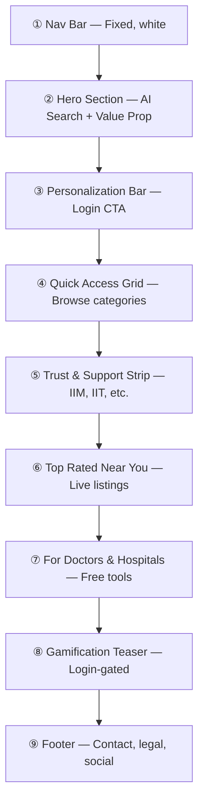

# EasyHeals Homepage Redesign — Design Document

> **Version:** 1.0  
> **Date:** 2026-03-21  
> **Status:** Ready for Review  
> **Author:** Antigravity AI + Biswajit  

---

## Visual Direction


---

## 1. Design Philosophy

### Core Principles

| Principle | Current State | Target State |
|-----------|--------------|--------------|
| **Color** | Dark hero section (#040d1a), white body sections | **Full white-based** — warm, bright, optimistic throughout |
| **Mood** | Tech-forward, dark, professional | **Warm, positive, healing** — like walking into a clean clinic |
| **Accessibility** | Functional but small text | **All-age friendly** — 16px+ body text, large touch targets, high contrast |
| **Mobile-first** | Responsive but desktop-designed | **Mobile-first** — matches future React Native app patterns |
| **Content** | Developer-oriented labels (RC#4, RC#3) | **Patient-oriented** — human, empathetic, no jargon |

### Color Palette (White-Based)

```
Primary Background     : #FFFFFF (pure white)
Secondary Background   : #F8FAF9 (warm off-white)
Accent Background      : #E6F5EC (soft mint green)
Primary Brand          : #1B8A4A (EasyHeals green)
Primary Dark           : #136836 (hover states)
Primary Light          : #D4F0E0 (subtle tints)
Secondary CTA          : #E8401C (warm orange — for "List Hospital" CTA)
Text Primary           : #1A2B23 (dark warm green — NOT pure black)
Text Secondary         : #5A7367 (muted green-gray)
Text Tertiary          : #8FA39A (light annotations)
Border                 : #D0E4D8 (soft green-gray borders)
Info Bar               : linear-gradient(135deg, #E6F5EC, #F0F7FF)
Trust Strip Background : #FAFBFC
```

> [!IMPORTANT]
> The dark hero section (#040d1a) is being **completely replaced** with a warm white/mint gradient. This is the single biggest visual change.

### Typography

```
Headlines     : var(--font-serif) — DM Serif Display 400
Subheadings   : var(--font-bricolage) — Bricolage Grotesque 700
Body          : var(--font-dmsans) — DM Sans 400/500
AI Chat       : var(--font-dmsans) — 15px for readability across ages
```

---

## 2. Page Architecture (Section-by-Section)

The page is organized into **9 distinct sections**, flowing from top to bottom. Each section maps to a clear user intent.



---

### Section ① — Navigation Bar (Kept — White Reskin)

**What stays:** Logo, nav links (Treatments/Hospitals/Doctors), Language picker, Login/Dashboard, "List Hospital Free" CTA.

**What changes:**
- Background: `#FFFFFF` with `box-shadow: 0 1px 3px rgba(0,0,0,0.06)` (no dark background)
- Logo text: `Easy` in `#1A2B23` (dark), `Heals` in `#1B8A4A` (green)
- Nav links: `#5A7367` (gray-green), hover `#1B8A4A`
- Language dropdown: white bg with green border, dropdown also white
- Login: outlined green button
- "List Hospital Free": solid green `#1B8A4A` pill

**Mobile:** Hamburger menu (currently hidden on mobile — stays hidden, just reskinned to white)

---

### Section ② — Hero Section (Major Redesign)

**Current:** Dark (#040d1a) with floating orbs, grid overlay, large serif headline, chat on left, results panel on right.

**New Design:**

```
┌─────────────────────────────────────────────────────┐
│                   HERO (White BG)                    │
│                                                      │
│  [Pill: AI-Powered Healthcare · Multilingual]        │
│                                                      │
│  "Tell us what you need.                            │
│   We'll find the right care."                       │
│                                                      │
│  "Describe your symptoms in any language.           │
│   Our AI connects you with the best hospitals       │
│   and doctors — no medication advice, ever."        │
│                                                      │
│  ┌────────────────────────────────────────────┐     │
│  │  🔍 AI Search Chat Box (ChatSearch)        │     │
│  │  ─────────────────────────────────────────  │     │
│  │  [I have headaches] [Knee pain] [MRI near] │     │
│  └────────────────────────────────────────────┘     │
│                                                      │
│  [Stats: 12k+ Hospitals · 50+ Cities · 5 Lang]     │
│                                                      │
│              ── Search Results Panel ──              │
│              (shows below on interaction)            │
└──────────────────────────────────────────────────────┘
```

**Key Changes:**
- Background: `linear-gradient(180deg, #FFFFFF 0%, #F8FAF9 100%)` — NO dark section
- Floating orbs: **removed** (replaced by subtle soft gradient circles using mint/green)
- Grid pattern: **removed** (clean white space)
- Hero layout: **Single column centered** (instead of 2-column grid) — better for mobile parity
- AI Chat (`<ChatSearch>`) stays centered and prominent
- Search results panel: moves BELOW the chat (stacks vertically instead of side-by-side grid)
- Stats bar: lighter design with green numbers, white card background
- Trust badges ("DPDP Compliant", "Verified Listings", "Free to Use"): move to section ⑤

**AI Search Behavior (Enhanced):**
- Search should continuously learn from patient interactions
- Results should show matched **doctors**, **hospitals**, **treatments**, and **tests** from EasyHeals data
- System should probe for more symptoms (conversational diagnosis) before recommending
- **Must not give medication advice** — AI prompt system instruction enforced
- Follow-up suggestions should be more conversational: "Can you tell me more about the pain?"

---

### Section ③ — Personalization Info Bar (NEW)

**Purpose:** Encourage guest users to log in for personalized experience. Not intrusive — just informative.

```
┌─────────────────────────────────────────────────────────┐
│  🔒  Login for personalized health suggestions,         │
│      appointment tracking, health timeline & rewards     │
│                                            [ Sign In ]   │
└─────────────────────────────────────────────────────────┘
```

**Design:**
- Background: `linear-gradient(135deg, #E6F5EC 0%, #F0F7FF 100%)`
- Border: `1px solid #D0E4D8`
- Border-radius: `16px`
- Full-width within content container
- Dismissible (X button) — stores in localStorage once dismissed
- **Hidden for logged-in users** — they see the dashboard CTA instead

**Information preview (for non-logged users):**
A short list of what's behind the login:
- 📅 Appointment management
- 📊 AI health timeline
- 🏆 Points, streaks & city leaderboard
- 📋 Prescription uploads & reports
- 🤖 Personal AI health coach

---

### Section ④ — Quick Access Grid (Restyled)

**What stays:** 6 cards (Hospitals, Doctors, Lab Tests, Treatments, Symptoms, List Hospital Free)

**What changes:**
- Cards: white bg, border `#D0E4D8`, shadow on hover `0 4px 16px rgba(27,138,74,0.10)`
- Icons: use the existing SVG icons but in `#1B8A4A` with `#E6F5EC` circle backgrounds
- "List Hospital Free" card stays orange gradient
- Developer labels ("RC#4 Pan India Private Coverage") → **Removed entirely**
- Human headline instead: "What are you looking for?"
- Subtitle: "Find the right healthcare across India"
- No more "Government hospitals are excluded by rule" text

---

### Section ⑤ — Trust & Support Strip (NEW — Major requirement)

**Purpose:** Show institutional backing prominently. This is a key business requirement.

```
┌──────────────────────────────────────────────────────────┐
│                   Supported By                           │
│  [ IIM Lucknow ]  [ IIT Mandi ]  [ IIHMR ]             │
│                                                          │
│                   Incubated At                           │
│  [ Deshpande Foundation ]  [ MSMF ]                     │
│                                                          │
│  ── DPDP Compliant · Verified Listings · Free to Use ── │
└──────────────────────────────────────────────────────────┘
```

**Design:**
- Background: `#FAFBFC`
- Text "Supported By": `#8FA39A` uppercase letterspaced label
- Institution names: styled as pill badges or clean text with subtle borders
- Should accept logo images when available (for now, text-based badges)
- "Incubated At" row below
- Trust indicators ("DPDP Compliant", etc.) as a subtle bottom strip

---

### Section ⑥ — Top Rated Near You (Restyled)

**What stays:** Category tabs (Hospital/Doctor/Treatment/Clinic), smart cards, ratings, "View Profile" links

**What changes:**
- Remove "RC#3 Crowd Listings + AI Outlier Detection" label
- Replace with: "Top Rated Near You" / "Top Rated in {City}"
- Subtitle: "Community-verified healthcare providers"
- Cards: white with soft border, no dark backgrounds
- Active tab: green background pill instead of dark (#040d1a)
- Symptom-to-specialist mapping section: moved inline as one of the tabs (instead of separate section)

---

### Section ⑦ — For Doctors & Hospitals (NEW — Redesigned from registerSection)

**Purpose:** Inform doctors/hospitals about the free appointment management system.

```
┌──────────────────────────────────────────────────────────┐
│  🏥  For Doctors & Hospitals                             │
│                                                          │
│  "Manage appointments, patient flow, and your           │
│   online presence — completely free."                   │
│                                                          │
│  ✅ Free appointment management system                   │
│  ✅ OPD token queue management                           │
│  ✅ Patient records (EMR-lite) access                    │
│  ✅ AI-powered patient summaries                         │
│  ✅ WhatsApp notifications for patients                  │
│                                                          │
│  [ Register Your Hospital — Free ]  [ Learn More ]      │
└──────────────────────────────────────────────────────────┘
```

**Design:**
- Two-column layout: Left = text + features, Right = illustration or screenshot
- Background: subtle gradient `#F8FAF9` → `#FFFFFF`
- CTA: Green solid button "Register Your Hospital — Free"
- Secondary: outlined "Learn More" button

---

### Section ⑧ — Gamification Teaser (Login-Gated, Already Exists)

**What stays:** The `<RewardsTeaser />` component

**What changes:**
- Position: moved directly above footer (instead of inline in middle)
- For logged-in users: this becomes the first priority content (gamification detail visible)
- For guests: locked teaser with "Login to unlock" CTA
- Design: stays similar but with updated colors to match white theme

---

### Section ⑨ — Footer (Enhanced)

**What stays:** Company name, phone, email, address

**What adds:**
- "© 2026 EasyHeals Technologies Pvt. Ltd."
- Privacy Policy | Terms of Service links
- Social media icons (if available)
- "Supported by IIM Lucknow, IIT Mandi, IIHMR" (compact repeat for SEO)

---

## 3. Mobile App Alignment

Since a React Native mobile app is planned, the homepage redesign considers these architectural choices:

### Shared Patterns

| Pattern | Web | Mobile (Future) |
|---------|-----|---------|
| AI Search | `ChatSearch` component | Same API, native chat UI |
| Auth | Cookie-based session | Bearer token from same `/api/auth/*` |
| Quick Access | 6-card grid | 2x3 grid or horizontal scroll |
| Personalization bar | Sticky banner | In-app notification |
| Gamification | [RewardsTeaser](file:///c:/Biswajit/Codex/easyheals-next/src/components/gamification/RewardsTeaser.tsx#3-154) | Native widget with animations |
| Language | Cookie + LocaleProvider | Device locale detection |

### API Considerations

All new homepage features should use **versioned APIs** (`/api/v1/`) that return standard JSON envelopes:

```json
{
  "success": true,
  "data": { ... },
  "meta": { "page": 1 }
}
```

---

## 4. Component Architecture

```
src/components/homepage/
├── HeroSection.tsx           (headline + ChatSearch + stats)
├── PersonalizationBar.tsx    (login encouragement banner)
├── QuickAccessGrid.tsx       (6-card category grid)
├── TrustStrip.tsx            (IIM/IIT/IIHMR + Deshpande/MSMF)
├── TopRatedSection.tsx       (category tabs + listing cards)
├── ProviderCTA.tsx           (for doctors/hospitals section)
├── GamificationSection.tsx   (wraps RewardsTeaser, login-gated)
├── Footer.tsx                (enhanced footer)
└── homepage.module.css       (all styles)
```

**What's preserved from current code:**
- `ChatSearch` component (search/ChatSearch.tsx) — kept as-is
- `SearchResults` component — kept, just restyled
- `RegistrationModal` — kept, launched from ProviderCTA
- `ContributeModal` — kept
- [RewardsTeaser](file:///c:/Biswajit/Codex/easyheals-next/src/components/gamification/RewardsTeaser.tsx#3-154) — kept, restyled
- All i18n hooks (`useTranslations`) — kept
- Location detection logic — kept
- Auth state check — kept

---

## 5. Implementation Plan

### Phase A — Structural Changes (CSS + Layout)

| Step | Task | Files |
|------|------|-------|
| A1 | Create new CSS module `homepage.module.css` with white-based design tokens | New file |
| A2 | Create component stubs for all 8 sections | New files |
| A3 | Rewrite [PhaseOneHome.tsx](file:///c:/Biswajit/Codex/easyheals-next/src/components/phase1/PhaseOneHome.tsx) to compose the new sections | Modified |
| A4 | Remove dark hero styles, orbs, grid overlay | CSS changes |
| A5 | Restyle nav bar to white | CSS + JSX |

### Phase B — New Content Sections

| Step | Task | Files |
|------|------|-------|
| B1 | Build `PersonalizationBar` with localStorage dismiss | New component |
| B2 | Build `TrustStrip` with institution badges | New component |
| B3 | Build `ProviderCTA` with feature list | New component |
| B4 | Enhance footer with privacy + social links | Modified component |

### Phase C — AI Search Enhancements

| Step | Task | Files |
|------|------|-------|
| C1 | Update AI search prompt to prevent medication advice | API / prompt changes |
| C2 | Add conversational follow-up for symptoms | AI search logic |
| C3 | Surface doctors/hospitals from EasyHeals data in results | ChatSearch + API |

### Phase D — i18n Updates

| Step | Task | Files |
|------|------|-------|
| D1 | Add new translation keys for all new sections | translations.ts |
| D2 | Translate to hi, mr, ta, bn | translations.ts |

---

## 6. Backup Status

| File | Backup Location | Status |
|------|----------------|--------|
| [PhaseOneHome.tsx](file:///c:/Biswajit/Codex/easyheals-next/src/components/phase1/PhaseOneHome.tsx) | `PhaseOneHome.backup.tsx` | ✅ Backed up |
| [phase1.module.css](file:///c:/Biswajit/Codex/easyheals-next/src/components/phase1/phase1.module.css) | `phase1.module.backup.css` | ✅ Backed up |
| [page.tsx](file:///c:/Biswajit/Codex/easyheals-next/src/app/page.tsx) | `page.backup.tsx` | ✅ Backed up |

---

## 7. What Is NOT Changing

- **SiteNav component** ([SiteNav.tsx](file:///c:/Biswajit/Codex/easyheals-next/src/components/SiteNav.tsx)) — Stays for non-homepage pages (white reskin will be scoped)
- **API endpoints** — No backend changes
- **Dashboard** (`/dashboard`) — Stays as-is
- **Login** (`/login`) — Stays as-is
- **Admin** (`/admin`) — Stays as-is
- **All profile pages** (`/hospitals/[slug]`, `/doctors/[slug]`, `/treatments/[slug]`) — No changes
- **Search API** (`/api/search/ai`) — Enhancement only, no breaking changes

---

> [!TIP]
> **Next step:** After review, I will implement Phase A (structural CSS + layout changes) first, then build the new sections one by one. The existing `ChatSearch` and `SearchResults` components continue to work — they just get a visual reskin.
